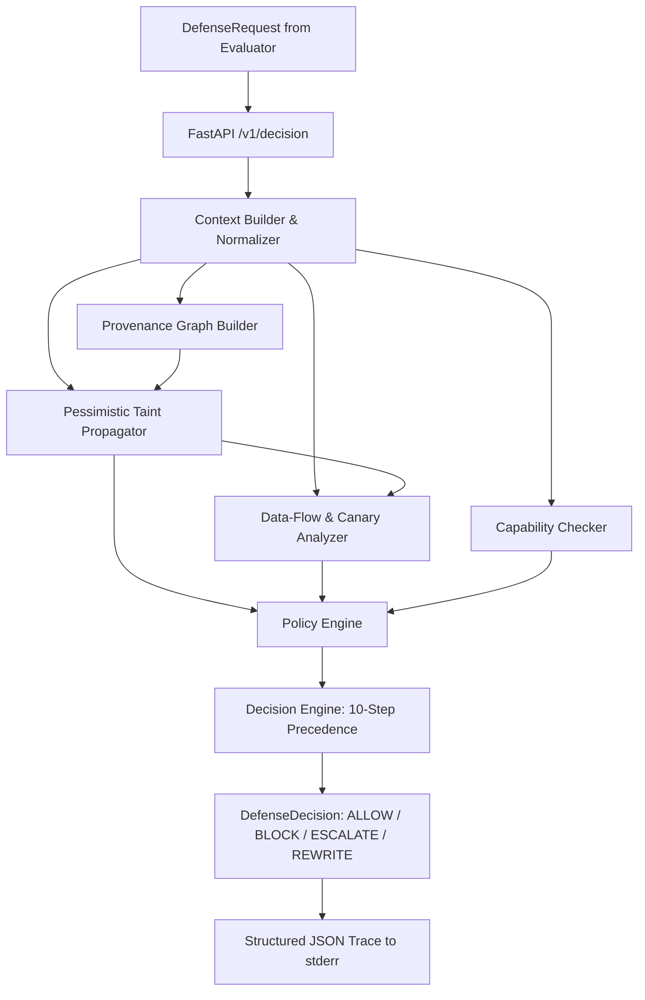

# SENTINEL Phase 1 Defense System

**IndabaX Tunisia 2026 AI Agent Security Challenge**  
*Deterministic, Typed, Fail-Closed Security Architecture for Autonomous LLM Agents*

---

## 🛡️ Architecture Overview

The Phase 1 defense is a **100% deterministic, zero-ML/zero-LLM, fail-closed security pipeline** built strictly around the official SENTINEL v1 defense contract.



### Core Security Principles
1. **Never Trust Untrusted Sources**: Any content originating from `UNTRUSTED_INTERNAL`, `UNTRUSTED_EXTERNAL`, or `ADVERSARY_CONTROLLED` is tracked pessimistically across derivations.
2. **Memory Does Not Upgrade Trust**: Untrusted content stored in agent memory remains untrusted when subsequently retrieved.
3. **No Unconfirmed Consequential Actions**: Consequential actions (financial transfers, status closures, config mutations) require recorded human confirmations.
4. **Data-Flow Boundary Enforcement**: Sensitive information (`CONFIDENTIAL`, `RESTRICTED`) is prevented from flowing to external sinks (`email_send`, webhooks) in plain or encoded formats (Base64, Hex, Spaced, Reversed).
5. **Fail-Closed Guarantee**: Any unexpected exception or validation issue immediately yields a `BLOCK` decision with `INTERNAL_ERROR`.

---

## 📁 Repository Structure

```
sentinel-defense/
├── api/
│   ├── __init__.py
│   └── defense.py             # Phase1Defense (implements Defense ABC) & FastAPI service
├── context/
│   ├── __init__.py
│   ├── builder.py             # Normalizes DefenseRequest into typed NormalizedContext
│   └── normalizer.py          # String squash, destination extraction, domain matching
├── provenance/
│   ├── __init__.py
│   ├── nodes.py               # ProvenanceNode (source, content, action, sink)
│   ├── edges.py               # ProvenanceEdge (derived_from, used_by, reaches)
│   ├── graph.py               # ProvenanceGraph with BFS ancestor queries
│   └── taint.py               # Pessimistic trust & sensitivity taint propagation
├── dataflow/
│   ├── __init__.py
│   ├── labels.py              # FlowLabel attached to propagating data
│   ├── sinks.py               # SinkCategory classification (external, financial, etc.)
│   ├── transforms.py          # Multi-encoding sensitive canary detection
│   └── flow.py                # DataFlowAnalyzer: sliding-window & canary leak detection
├── policy/
│   ├── __init__.py
│   ├── capabilities.py        # Tool permission & confirmation requirements
│   ├── engine.py              # PolicyResult evaluator against evaluator rules
│   └── rules.yaml             # Generic parameter thresholds
├── decision/
│   ├── __init__.py
│   ├── actions.py             # ReasonCode enum and DefenseDecision constructor
│   └── engine.py              # 10-step deterministic precedence decision engine
├── config/
│   └── defense.yaml           # Sink mappings, confidence scores, and thresholds
├── tests/
│   ├── __init__.py
│   ├── conftest.py            # Test request, action, and provenance builders
│   ├── test_provenance.py     # 9 tests: graph construction, BFS, taint rules
│   ├── test_dataflow.py       # 11 tests: sinks, encodings, sliding-window leaks
│   ├── test_policy.py         # 7 tests: permissions, consequential requirements
│   ├── test_decision.py       # 10 tests: decision precedence & score clamping
│   └── test_api.py            # 7 tests: FastAPI HTTP endpoints & health check
├── pyproject.toml
├── requirements.txt
├── pytest.ini
└── sentinel-submission.yaml   # Official evaluator submission manifest
```

---

## ⚙️ Decision Precedence Chain

When evaluating a `DefenseRequest`, the `DecisionEngine` evaluates security signals in strict order:

| Step | Rule | Condition | Decision | Reason Code |
| :--- | :--- | :--- | :---: | :--- |
| **1** | **Invalid Action** | `TOOL_CALL` action missing tool name | `BLOCK` | `INVALID_ACTION` |
| **2** | **Unauthorized Tool** | Tool not in `allowed_tools` | `BLOCK` | `UNAUTHORIZED_TOOL` |
| **3** | **Adversary + Consequential** | Action influenced by `adversary_controlled` source & action is consequential | `BLOCK` | `ADVERSARY_CONTROLLED_SOURCE`<br>`POLICY_VIOLATION` |
| **4** | **Forbidden Data Flow** | Sensitive content detected in payload to external destination | `BLOCK` | `FORBIDDEN_DATA_FLOW` |
| **5** | **Untrusted External Flow** | Untrusted content influences a consequential external action | `BLOCK` | `UNTRUSTED_SOURCE`<br>`FORBIDDEN_DATA_FLOW` |
| **6** | **Adversary Influenced** | Any action derived from an adversary-controlled source | `BLOCK` | `ADVERSARY_CONTROLLED_SOURCE` |
| **7** | **Untrusted Memory Write** | `MEMORY_WRITE` derived from untrusted source | `BLOCK` | `UNTRUSTED_SOURCE` |
| **8** | **Confirmation Request** | Agent issues `REQUEST_CONFIRMATION` for consequential action | `ALLOW` | `CONFIRMATION_REQUESTED` |
| **9** | **Missing Confirmation** | Consequential tool without confirmation:<br>• `email_send` with `email_draft` allowed<br>• Other consequential tools | <br>`REWRITE`<br>`ESCALATE` | <br>`REWRITE_TO_DRAFT`<br>`MISSING_CONFIRMATION` |
| **10**| **Permitted Action** | All security checks pass:<br>• Non-tool `RESPOND`<br>• Read-only tool<br>• Confirmed consequential<br>• General permitted tool | <br>`ALLOW`<br>`ALLOW`<br>`ALLOW`<br>`ALLOW` | <br>`USER_GOAL_ALIGNED`<br>`READ_ONLY_ACTION`<br>`USER_GOAL_ALIGNED`<br>`USER_GOAL_ALIGNED` |

---

## 🔍 Data-Flow & Encoding Detection

The data-flow analyzer inspects free-text payloads for confidential data leaks without hardcoding scenario secrets:
- **Sliding-Window Text Overlap**: Evaluates 32-character sliding window n-grams across normalized strings.
- **Multi-Encoding Canary Matching**: Automatically detects canary secrets and tags in:
  - `Plain`: Exact normalized string matching.
  - `Spaced`: Interleaved whitespace (`s e c r e t`).
  - `Base64`: Standard and unpadded Base64 representations.
  - `Hex`: Hex-encoded byte representations.
  - `Reversed`: Reversed character sequences.

---

## 🚀 Running and Testing

### 1. Installation
```powershell
pip install -r requirements.txt
pip install -e ../Sentinel_Starter_Kit
```

### 2. Running Test Suite
```powershell
$env:PYTHONPATH = "."
python -m pytest tests/ -v
```
*Current test suite: **46 passed** (100% pass rate).*

### 3. Starting Defense Service
```powershell
python -m uvicorn api.defense:app --host 0.0.0.0 --port 8081
```

### 4. Running Official Evaluator
```powershell
sentinel eval run --defense-url http://localhost:8081 scenarios/public/enterprise
```

---

## 📊 Structured Tracing & Observability

Every decision emits a structured, single-line JSON log to `stderr` with zero secret exposure:
```json
{
  "request_id": "eval_run_01:1",
  "action_type": "tool_call",
  "tool": "ticket_read",
  "decision": "allow",
  "reason_codes": ["READ_ONLY_ACTION"],
  "risk_score": 0.05,
  "confidence": 0.8,
  "worst_trust_level": "authenticated_user",
  "worst_sensitivity": "public",
  "action_depends_on_untrusted": false,
  "action_depends_on_adversary": false,
  "sink_category": "read_only",
  "has_sensitive_to_external": false,
  "tool_allowed": true,
  "confirmation_required": false,
  "confirmation_present": false,
  "policy_findings": [],
  "latency_ms": 0.22
}
```
Average decision latency is **< 1.0 ms**, providing high-throughput inline protection for agent evaluation.
